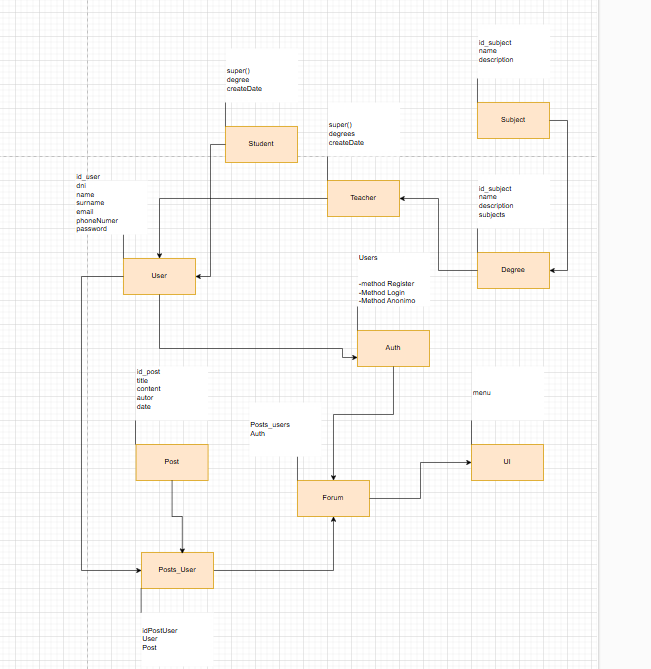

# Project POO RA2

## This forum app about Institut Poblenou, where you will do questions, doubts, Helps to community,where you find out topics specific and modified your profile and create Post, Update, Reads and Delete.

### Introduction

- Here a model like I thought when began:

.

### Entity 
- Here focus entity that appears: 
  - **User**
    - **Student**
    - **Teacher**
  - **Forum**
    - **Post**
    - **Posts_User**
  - **Degree**
    - **Subject**

### Features 

| Feature      | Description                                              | Status    |
|--------------|----------------------------------------------------------|-----------|
| Auth         | Can do (Register,Login and Login without Register)       | completed |
| Main Menu    | Can do Functionalities to Auth                           | Completed |
| Second Level | Can do Functionalities to forum(anonymous or registered) | Completed |
| Third Level  | Can do Functionalities to Profile(just registered)       | Completed |

### Auth

- Method add new User
- Method Login User
- Method Anonymous User

### Second Level 
- Method All Posts
- Method Show Post for Degree 
- Method Show Post for Subject
- Method Show Post for Subject
- Method Show Post Student or Teacher
- Method Search Post

## Third Level
- Method create new Post
- Method Read your Posts
- Method Update your Posts
- Method Delete your Posts

### Document about more explain 

[Document_about_Project](https://docs.google.com/document/d/19eTjgKEy29OtXhbo-SbTRn8K1jmmi6GtFTvif7uGcL8/edit?usp=sharing)